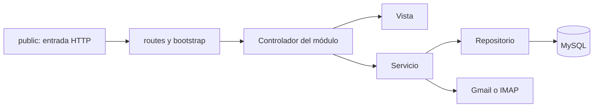

# Organización interna

## Decisiones

Se mantiene una sola aplicación y se separa su superficie pública del código
interno. No se introduce un framework ni se cambia el transporte de consultas.
Las direcciones actuales se conservan mediante entradas PHP pequeñas en public/;
estas cargan bootstrap y despachan al mapa de rutas. Las entradas contienen solo
la referencia al controlador, sin consultas ni vistas.

Los controladores se agrupan en Auth, Dashboard, Users, Schedules, Consultations,
Gmail, Links, Reports y Api. Las vistas tienen la misma agrupación. Un módulo
nuevo debe añadir su controlador, servicios/repositorios cuando correspondan,
vista, recursos y entrada de ruta. No debe copiar acceso a Gmail ni SQL de otros
módulos.

## Flujo

Para las consultas desde pantallas se conserva el tramo HTTP hacia la API
publicada. La API utiliza las clases de correo y extracción. La reorganización
no sustituye ese tramo por llamadas locales.

## Qué se separó

- Las 27 rutas de aplicación pasan a ser entradas pequeñas.
- Las plantillas de páginas y fragmentos se movieron a resources/views.
- El JavaScript de gráficos y tablas de home.php está en assets/js/dashboard.js.
  La vista entrega solo datos JSON; no hay PHP dentro del archivo JavaScript.
- El controlador del panel utiliza DashboardData y UsageRepository. Los días sin
  consultas de una operación se completan con cero y los conjuntos vacíos son válidos.
- Las cinco escrituras repetidas de uso están centralizadas en UsageRepository.
- La lectura, listado y guardado de tokens están en GmailTokenRepository. Gmail
  ya no abre la base de datos al cargar el archivo de su clase.
- Database centraliza la configuración de conexión. Las variables de entorno son
  opcionales y no cambian los valores predeterminados importados.
- Las clases nuevas usan el namespace FMGlobal y PSR-4. Las clases existentes de
  correo conservan sus nombres para limitar cambios de comportamiento; Composer
  las incluye por classmap. Bootstrap permite cargarlas también con vendor ya instalado.
- Las 25 imágenes idénticas se unificaron en public/assets/img; los archivos no
  duplicados se conservaron allí. Las referencias de plantillas se actualizaron.
- El JS duplicado de reportes se retiró; no era cargado por el panel. La hoja CSS
  de respaldo se conserva como referencia en docs/archive, fuera del sitio público.
- Los logs antiguos se trasladaron a storage/logs, ignorado por Git.

## Límites de esta reforma

La estructura está reorganizada, pero no se presenta como una reescritura total
de reglas de negocio. Los controladores heredados de usuarios, horarios y
reportes todavía contienen parte de su SQL y lógica. Se pueden extraer a
repositorios específicos por operación, con pruebas de contrato, en iteraciones
posteriores. Las vistas heredadas aún utilizan algunos resultados mysqli.

No se modificaron permisos por buzón, política OAuth, reglas de horarios,
expresiones de extracción ni parámetros de las consultas publicadas. Esos cambios
necesitan pruebas y decisiones propias, no deben ocultarse dentro de un traslado
de carpetas. Tampoco se cambiaron credenciales de producción ni se migró MySQL.

## Excepción explícita de mantenimiento

llama.php era un ejecutor de un comando fijo del servidor. Su contenido ahora está
en bin/run-token.php y solo funciona por CLI. public/llama.php responde HTTP 410.
No se encontraron llamadas a esa ruta dentro del código de la aplicación. Si
existe un consumidor externo, hay que coordinarlo antes de desplegar.