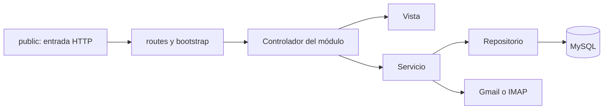

# Organización interna

## Decisiones

Se mantiene una sola aplicación y se separa su superficie pública del código
interno. No se introduce un framework ni se cambia el transporte de consultas.
Las direcciones actuales se conservan mediante entradas PHP pequeñas en public/;
estas cargan bootstrap y despachan al mapa de rutas. Las entradas contienen solo
la referencia al controlador, sin consultas ni vistas.

Los controladores se agrupan en Auth, Dashboard, Users, Schedules, Consultations,
Gmail, Links, Reports y Api. Las vistas tienen la misma agrupación. Un módulo
nuevo debe añadir su controlador, servicios/repositorios cuando correspondan,
vista, recursos y entrada de ruta. No debe copiar acceso a Gmail ni SQL de otros
módulos.

## Flujo

Para las consultas desde pantallas se conserva el tramo HTTP hacia la API
publicada. La API utiliza las clases de correo y extracción. La reorganización
no sustituye ese tramo por llamadas locales.

## Qué se separó

- Las 27 rutas de aplicación pasan a ser entradas pequeñas.
- Las plantillas de páginas y fragmentos se movieron a resources/views.
- El JavaScript de gráficos y tablas de home.php está en assets/js/dashboard.js.
  La vista entrega solo datos JSON; no hay PHP dentro del archivo JavaScript.
- El controlador del panel utiliza DashboardData y UsageRepository. Los días sin
  consultas de una operación se completan con cero y los conjuntos vacíos son válidos.
- Las cinco escrituras repetidas de uso están centralizadas en UsageRepository.
- La lectura, listado y guardado de tokens están en GmailTokenRepository. Gmail
  ya no abre la base de datos al cargar el archivo de su clase.
- Database centraliza la configuración de conexión. Las variables de entorno son
  opcionales y no cambian los valores predeterminados importados.
- Las clases nuevas usan el namespace FMGlobal y PSR-4. Las clases existentes de
  correo conservan sus nombres para limitar cambios de comportamiento; Composer
  las incluye por classmap. Bootstrap permite cargarlas también con vendor ya instalado.
- Las 25 imágenes idénticas se unificaron en public/assets/img; los archivos no
  duplicados se conservaron allí. Las referencias de plantillas se actualizaron.
- El JS duplicado de reportes se retiró; no era cargado por el panel. La hoja CSS
  de respaldo se conserva como referencia en docs/archive, fuera del sitio público.
- Los logs antiguos se trasladaron a storage/logs, ignorado por Git.

## Separación de lógica y controles comunes

Los controladores de usuarios, horarios y reportes utilizan repositorios específicos.
Usuarios y horarios aplican validación en servicios antes de guardar. Las vistas
heredadas de listados todavía reciben resultados mysqli para conservar su contrato.

El despachador aplica sesión, permisos según rol, métodos HTTP y CSRF. La sesión
se contrasta con la cuenta actual en cada operación protegida. Las llamadas de
correo pasan por MailApiClient y los proveedores implementan MailProvider.

Se conservan los destinos de producción y las reglas de extracción. El bloqueo
horario del login continúa desactivado. OAuth incorpora un estado de un solo uso;
la autorización debe iniciarse desde el mismo dominio y sesión que recibe el callback.
No se añade una migración de MySQL ni autenticación entre servidores a las API públicas.

Ver [BACKEND.md](BACKEND.md) para la matriz de permisos, cambios de comportamiento,
límites de compatibilidad y comandos de prueba.

## Excepción explícita de mantenimiento

llama.php era un ejecutor de un comando fijo del servidor. Su contenido ahora está
en bin/run-token.php y solo funciona por CLI. public/llama.php responde HTTP 410.
No se encontraron llamadas a esa ruta dentro del código de la aplicación. Si
existe un consumidor externo, hay que coordinarlo antes de desplegar.

## Permisos dinámicos y nuevo Inicio

La gestión de accesos ahora se guarda por perfil y por usuario en la base de datos. Las reglas fijas descritas anteriormente se conservan como configuración inicial, no como autorización permanente. Esta entrega agrega una migración de tablas de permisos que debe ejecutarse antes de desplegar; reemplaza la indicación anterior de que no había cambios de esquema. Consulte [Permisos y dashboard](PERMISSIONS_AND_DASHBOARD.md) para uso, alcance, migración y pruebas.

La cuenta reservada de superusuario (id 1, usuario admin) dispone de todos los permisos del catálogo, independientemente del perfil o las excepciones. No aparece en el selector de permisos por usuario y se rechazan cambios directos a sus permisos. Los demás administradores siguen las reglas configuradas en base de datos.

## Sesión por inactividad

Session::IDLE_SECONDS define 1800 segundos. El login inicializa last_activity; Access rechaza la sesión al alcanzar el límite y borra identidad y CSRF. Las peticiones internas autorizadas renuevan el plazo después de verificar CSRF. Las API públicas y Validación no prolongan la sesión. Las sesiones anteriores sin timestamp se incorporan al primer acceso autorizado.

En el panel session.js avisa dos minutos antes. Interacciones reales renuevan por POST session.php, con CSRF, como máximo una vez por minuto; el botón Continuar sesión fuerza la renovación. No hay renovación automática en reposo. Las pestañas de una misma sesión comparten el plazo; al volver de suspensión se comprueba inmediatamente. Respuestas 401 de fetch y jQuery (también global:false) llevan al login con mensaje de vencimiento. No se repiten automáticamente operaciones de guardado.