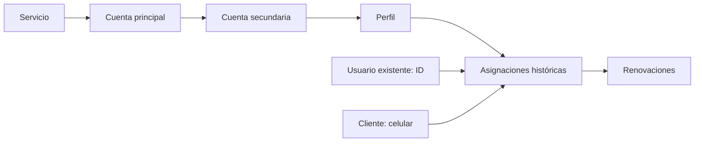

# Spotify: requerimientos y casos de uso

Estado: módulo operativo inicial implementado en local. Carga CSV implementada (sección 13). Dashboard, reportes y mantenimientos de Clientes/Tipos de servicio quedan aplazados por indicación del usuario. Los apartados de propuesta conservan el contexto de diseño; ver alcance implementado al final.
Base: acuerdos de la conversación con el usuario. Las propuestas pendientes se distinguen al final.

## 1. Alcance confirmado

- Opción Spotify en Gestión, debajo de Link Netflix.
- Incorporación al mantenimiento de permisos existente, con acceso inicial únicamente para el administrador. Podrá concederse por perfil o por excepción individual.
- Administrador: inventario completo y todas las operaciones.
- Usuario operativo: cualquier usuario con permiso, no solamente el perfil Asesor. Solo ve sus asignaciones y el número de espacios disponibles; no recibe correos ni contraseñas de inventario libre o ajeno.
- Datos de clientes existentes y asignaciones activas deben poder cargarse conservando fechas reales.
- No se integra una API de Spotify para modificar contraseñas: el sistema registra cambios realizados externamente.
- Mantener AdminLTE y los componentes aprobados de tablas, filtros, formularios, modales, botones, paginación y búsqueda.

## 2. Modelo lógico

Los nombres de tablas son propuestas técnicas; sus relaciones representan los acuerdos funcionales.

| Entidad | Datos y relaciones |
| --- | --- |
| Servicios | ID, nombre, estado, máximo de cuentas secundarias y máximo de perfiles por secundaria. Spotify: 5 y 1 respectivamente. |
| Cuentas principales | ID, servicio, correo principal, correo de pago informativo, fecha del próximo pago y estado. |
| Cuentas secundarias | ID, cuenta principal, correo exclusivo, contraseña cifrada y estado habilitada/caída. |
| Perfiles | ID, cuenta secundaria, nombre y estado. Si no se indica nombre al registrar: Perfil 1. |
| Clientes | Celular internacional como clave primaria de texto, nombre. |
| Asignaciones | ID, perfil, celular del cliente, ID del asesor, inicio, vencimiento, fecha de cierre y motivo de cierre. |
| Renovaciones | ID, asignación, vencimiento anterior, nuevo vencimiento, fecha real de la operación e ID del responsable. |
| Auditoría | Operación, entidad, ID del responsable y fecha; cambios relevantes sin contraseñas ni secretos. |

Reglas de integridad:

- Cada secundaria pertenece a una sola principal y su correo no se duplica.
- Se mantiene la relación de varios perfiles aunque Spotify admita uno actualmente.
- Cada perfil admite como máximo una asignación vigente, con un cliente y un asesor. Un cliente puede contratar varios perfiles.
- El celular se normaliza con prefijo internacional; no asumir Perú ni otro país cuando falte ese dato. Una corrección del celular debe conservar relaciones e historial.
- Contraseña obligatoria en el alta de cada secundaria. El nombre de perfil es opcional; un nombre vacío crea Perfil 1.
- Los límites se comprueban también en servidor e importaciones. Disminuir un límite no elimina registros existentes.
- La fecha de pago pertenece a la principal y significa próximo pago al proveedor; no es la fecha de pago del cliente. El correo de pago es informativo.
- El inicio del cliente pertenece a su asignación; no se sobrescribe al renovar.
- Los días restantes son calculados, no columnas que deban actualizarse diariamente.

## 3. Estados y disponibilidad

Estado de secundaria y ocupación del perfil son conceptos separados:

| Situación | ¿Puede entregarse? |
| --- | --- |
| Secundaria habilitada y perfil libre | Sí. |
| Perfil con asignación vigente | No. |
| Secundaria caída, aunque sus perfiles estén libres | No. |
| Próximo pago del proveedor vencido | No afecta la disponibilidad. |

La selección entre espacios elegibles es aleatoria. La asignación se confirma en una transacción con protección contra solicitudes simultáneas. No puede entregarse el mismo perfil a dos usuarios.

Marcar Caído afecta a toda la secundaria: cierra sus asignaciones vigentes y bloquea todos sus perfiles. El usuario confirmó este alcance también para un futuro con varios perfiles. Solo un administrador puede rehabilitarla; sus perfiles libres vuelven a estar disponibles sin depender de la fecha de pago.

Liberar no elimina clientes, cuentas, perfiles ni históricos. Cierra la asignación y libera el espacio.

## 4. Fechas

- Alta de asignación: vencimiento inicial = inicio registrado + un mes.
- Renovación: nuevo vencimiento = vencimiento registrado + un mes, incluso si ya pasó. Nunca se calcula desde hoy por el solo hecho de estar vencido.
- Última renovación: fecha de la última operación de renovación. Es distinta del vencimiento y no se usa como base para contar días.
- Sin renovaciones: mostrar un valor vacío legible, no una fecha inventada.
- Colores para proveedor y cliente: más de 3 días, verde; entre 0 y 3 días inclusive, amarillo; fecha vencida, rojo.
- El día de vencimiento cuenta como 0, no como vencido, para esta señalización por fecha.
- Las operaciones conservan fecha/hora e identidad del responsable.
- Regla confirmada para meses cortos: si el día no existe, usar el último día del mes destino. La siguiente renovación parte del vencimiento ajustado: 31/01/2027 → 28/02/2027 → 28/03/2027.

Ejemplo sin ambigüedad de calendario: inicio 10/09, vencimiento 10/10. Si renueva el 20/10, el vencimiento pasa al 10/11 y la última renovación muestra 20/10.

## 5. Listado

Una fila por perfil, con su asignación vigente cuando exista. El administrador puede consultar también inventario libre y caído. El usuario operativo solo recibe filas propias vigentes.

| Campo | Administrador | Operativo |
| --- | --- | --- |
| Servicio | Sí | Sí |
| Correo principal | Sí | No |
| Correo de pago | Sí | No |
| Próximo pago al proveedor | Sí | No |
| Días para pago al proveedor | Sí | No |
| Correo secundario | Sí | Solo asignado |
| Contraseña secundaria | Sí | Solo asignada |
| Perfil | Sí | Solo asignado |
| Asesor | Sí | Propio |
| Inicio del servicio | Sí | Propio |
| Última renovación | Sí | Propia |
| Días hasta vencimiento del cliente | Sí | Propios |

Propuesta de presentación pendiente: añadir cliente/celular y fecha explícita de vencimiento para identificar al cliente y explicar el contador. El cliente ya forma parte del modelo, aunque no se haya confirmado su columna.

Acciones según situación: asignar/obtener, renovar, liberar, marcar Caído y rehabilitar. Rehabilitar es exclusivo del administrador. El detalle exacto de botones y filtros se diseña después; no confundir permiso del módulo con acceso a filas ajenas.

## 6. Casos de uso

### SP-01. Registrar inventario

Actor: administrador.

1. Selecciona servicio y registra correo principal, correo de pago y próximo pago.
2. Añade dinámicamente secundarias con correo, contraseña y perfiles.
3. El servidor valida duplicados y capacidades; crea Perfil 1 si se omitió el nombre.
4. Guarda las relaciones y la auditoría. Ante un error, evita dejar relaciones parciales.

### SP-02. Obtener una cuenta

Actor: usuario con permiso; el administrador también puede asignar a un asesor.

1. Selecciona servicio, identifica al cliente por celular o registra nombre y celular, e indica inicio.
2. El servidor selecciona un perfil elegible y lo asigna al usuario de la sesión. Solo el administrador puede elegir otro asesor.
3. Guarda inicio, vencimiento e identidad del responsable.
4. Muestra el correo asignado, perfil y contraseña. Ofrece conservarlos o registrar cambios de contraseña y nombre del perfil.
5. La cuenta aparece en su listado. Si no hay disponibilidad, informa y no crea una asignación.

La contraseña nueva se cambia externamente; guardar en esta aplicación no modifica Spotify. Si cierra la pantalla posterior sin guardar cambios opcionales, la asignación permanece con los datos originales. Si no hay stock, se conserva el cliente recién registrado, pero no se crea una asignación.

### SP-03. Renovar

Actor: titular de la asignación con permiso o administrador.

1. Selecciona su asignación y solicita renovar.
2. El servidor valida propiedad y que la asignación siga vigente; calcula un mes sobre el vencimiento registrado.
3. Registra renovación y actualiza vencimiento de forma atómica. Conserva inicio e historial.
4. Actualiza fechas, contador y color. Evitar que un doble envío accidental sume dos meses.

### SP-04. Liberar

Actor: titular con permiso o administrador.

1. Solicita liberar.
2. Registra obligatoriamente una contraseña nueva y opcionalmente un nombre de perfil nuevo. Si omite el nombre, se conserva el actual.
3. El servidor valida la asignación y guarda los cambios junto con su cierre.
4. El perfil vuelve a disponibles si la secundaria está habilitada.
5. Desaparece del listado operativo; el historial y cliente permanecen.

Sin contraseña nueva no se completa la liberación. La aplicación no puede verificar que el cambio externo se haya realizado.

### SP-05. Marcar Caído

Actor: titular con permiso o administrador.

1. Marca Caído; motivo opcional según lo conversado.
2. Se marca toda la secundaria como caída y se cierran sus asignaciones, dejando constancia del motivo de cierre.
3. Se retira del listado operativo y aparece en el listado administrativo de caídos.
4. No entra en disponibles. Esta operación no usa el formulario de cambio obligatorio de contraseña de la liberación normal.

### SP-06. Rehabilitar una cuenta

Actor: administrador.

1. Revisa el correo caído y sus datos.
2. Corrige lo necesario y habilita la secundaria.
3. Registra la operación. Los perfiles libres podrán entregarse independientemente de la fecha de pago.
4. No restaura automáticamente asignaciones cerradas por caída.

### SP-07. Actualizar próximo pago

Actor: administrador.

Actualiza la fecha registrada tras el pago al proveedor. Se recalcula la alerta informativa, sin modificar la disponibilidad de sus perfiles libres; se registra quién cambió la fecha. No modifica los vencimientos individuales de clientes.

### SP-08. Cargar datos existentes

Actor: administrador.

Carga relaciones de inventario, clientes y asignaciones existentes. Conserva inicio y vencimiento actuales; no inventa renovaciones. Valida celulares, correos exclusivos, capacidades y referencias a asesores existentes por ID. Formato y política de errores pendientes de definir.

## 7. Comprobaciones de aceptación previstas

- Permiso inicial únicamente del administrador; una excepción individual puede habilitar a un operativo.
- No exponer datos del proveedor ni credenciales libres/ajenas mediante HTML, JSON, búsqueda, IDs manipulados o exportaciones.
- Dos solicitudes simultáneas no obtienen el mismo perfil.
- No entregar cuentas caídas. Los datos de pago al proveedor son informativos y no restringen asignaciones.
- Liberación exige contraseña nueva; caída bloquea la cuenta completa y no la libera a la bolsa.
- No permitir renovar o modificar una asignación cerrada; conservar su historial.
- Solo el administrador rehabilita y opera sobre asignaciones ajenas.
- Colores correctos en los límites 4, 3, 0 y -1 días.
- Renovar desde el vencimiento registrado, no desde la fecha de ejecución.
- Importación conserva fechas sin duplicar clientes/perfiles ni inventar movimientos.
- Guardar contraseñas cifradas y excluirlas de auditoría, logs y mensajes técnicos.
- Documentar una migración aditiva e incorporarla al ejecutor del pase; no ejecutar nada en producción durante el desarrollo.

## Reglas adicionales confirmadas

- Una asignación vencida permanece ocupada y visible en rojo hasta que se renueve o libere expresamente. No vuelve automáticamente a disponibles.
- Si el asesor pierde el permiso o queda inactivo, conserva sus asignaciones pero pierde el acceso. El administrador recibe una alerta para reasignarlas o liberarlas.
- Las renovaciones de meses cortos se ajustan al último día del mes destino y las siguientes parten de ese vencimiento ajustado.
- Cerrar la pantalla posterior a recibir la cuenta no libera la asignación: conserva contraseña y perfil originales si no se guardaron cambios.
- Si se registra un cliente nuevo y no hay disponibilidad, el cliente se conserva sin asignación.

## 8. Decisiones aún pendientes

No son requisitos aprobados ni deben implementarse por suposición silenciosa.

1. **Capacidad futura mayor a uno:** la contraseña pertenece al correo secundario y la comparten sus perfiles. Definir cambios de contraseña y liberación cuando otros clientes sigan usándola antes de habilitar ese escenario. Con capacidad uno no hay uso compartido.
2. **Importación:** acordar archivo modelo, datos para vincular asesores, duplicados, fechas y errores parciales. No hay formato aprobado aún.
3. **Presentación y alertas:** definir filtros, columnas de cliente/vencimiento, ubicación de alertas de proveedor y listado de caídos. No se ha solicitado todavía un reporte independiente ni una tarjeta nueva de dashboard.

## 9. Próximo paso

Revisar el módulo operativo implementado en local. CSV, dashboard, reportes y mantenimientos independientes se retomarán después, por indicación del usuario. El esquema y las migraciones de la primera etapa ya están preparados; ver sección 12.

## 10. Diseño de pantallas de referencia

Se reutilizan componentes AdminLTE aprobados. La sección 12 delimita lo implementado; las opciones de importación y mantenimientos independientes permanecen aplazadas.

### Administrador

- Encabezado Spotify y categoría Gestión a la derecha.
- Acciones superiores: Agregar cuenta principal e Importar datos.
- Vistas Todos, Disponibles, Asignadas y Caídas. Caídas muestra cuentas secundarias, evitando repetir la misma cuenta por cada perfil.
- Búsqueda y filtros por servicio, asesor y vencimiento, sin botón Aplicar; tamaño de página y paginación iguales a las tablas existentes.
- Listado general con los datos del proveedor y del cliente. Propuesta: agrupar columnas por proveedor y servicio al cliente, con desplazamiento horizontal en pantallas pequeñas.
- Avisos sobre próximos pagos, cuentas caídas y asignaciones de usuarios sin acceso. La ubicación exacta queda por revisar.

### Usuario operativo

- Encabezado Spotify / Gestión y botón Obtener cuenta.
- Conteo de espacios disponibles por servicio, sin revelar correos ni contraseñas libres.
- Tabla exclusivamente con sus asignaciones; no incluye información de la cuenta principal o del pago al proveedor.
- Acciones de fila: Renovar, Liberar y Caído.

### Modales

| Modal | Contenido propuesto |
| --- | --- |
| Agregar/editar inventario | Datos de la principal y bloques dinámicos de secundarias con correo, contraseña y nombre de perfil opcional. |
| Obtener cuenta | Servicio, búsqueda de cliente por celular internacional, alta de cliente si no existe y fecha de inicio. |
| Cuenta asignada | Correo, perfil y contraseña recibidos; opciones para conservarlos o registrar cambios externos. |
| Renovar | Cliente, vencimiento actual y vencimiento resultante antes de confirmar. |
| Liberar | Contraseña nueva obligatoria y nombre de perfil opcional; aviso de cierre de asignación. |
| Marcar Caído | Cuenta afectada, motivo opcional y explicación de que sale de disponibles hasta revisión administrativa. |
| Rehabilitar | Revisión administrativa de correo, contraseña y perfil antes de habilitar; no restaura asignaciones cerradas. |

Las reglas de abandono posterior a asignación y alta de cliente sin stock están confirmadas e implementadas. El formato de carga se definirá cuando se retome el CSV.

## 11. Propuesta de carga inicial — pendiente de confirmación

Archivo CSV modelo descargable, una fila por perfil. Para Spotify con capacidad actual, equivale a una fila por correo secundario. Repetir los datos de la principal en sus filas; no se crean principales duplicadas por esa repetición.

| Grupo | Columnas propuestas |
| --- | --- |
| Servicio y proveedor | servicio, correo_principal, correo_pago, proximo_pago |
| Inventario | correo_secundario, contrasena, perfil, estado_cuenta |
| Asignación existente | asesor_usuario, cliente_nombre, cliente_celular, inicio_servicio, vencimiento_servicio |
| Información histórica opcional | ultima_renovacion |

Propuestas de validación:

- Perfil vacío se convierte en Perfil 1. Estado de cuenta: habilitada o caida; sin asignación equivale a libre, no a un tercer estado de cuenta.
- Fechas ISO YYYY-MM-DD para la carga, con formato de visualización habitual del aplicativo. Celular como texto internacional con + y código de país.
- Para inventario libre, dejar vacíos todos los campos de asignación. Para asignaciones existentes, exigir cliente, asesor, inicio y vencimiento; una cuenta caída no admite asignación vigente.
- Identificar al asesor en el CSV por su login único, resolverlo a su ID y mostrar su nombre en la revisión. No relacionarlo por nombres personales ambiguos.
- Un cliente existente se identifica por celular; no sobrescribir su nombre silenciosamente si difiere. Resolver discrepancias en la revisión.
- Validar que las filas repetidas de una principal tengan datos de proveedor coherentes y respeten la capacidad de cinco secundarias.
- No sobrescribir credenciales, asignaciones ni inventario existente de forma implícita. Informar los duplicados para revisión.
- Si se informa una última renovación histórica, conservarla como dato de origen importado; no fabricar un movimiento con fecha, actor o vencimiento anterior desconocidos. Dejarla vacía si no se conoce.
- Propuesta: presentar una previsualización de filas válidas y errores antes de importar; el usuario decide si carga solo las válidas. Toda fila aceptada debe dejar relaciones completas.
- Propuesta de informe: número de fila, correo secundario y motivo del rechazo, sin incluir contraseñas. El comportamiento exacto aún no está aprobado.

La importación de históricos asignados a usuarios actualmente inactivos o sin permiso requiere una regla específica: no descartar ni reasignar esos clientes automáticamente. Revisar con el administrador durante la carga.

## 12. Alcance implementado en esta etapa

- Ruta `gestion/spotify.php` y URL limpia `sistema/spotify`; Gestión → Spotify, inmediatamente después de Link Netflix.
- Permiso independiente `services.spotify`, inicialmente solo para administrador. Usa la configuración de perfiles y excepciones existente.
- Alta y edición de principales con correos secundarios, contraseñas cifradas y perfiles. Límites iniciales 5/1; Perfil 1 cuando se deja vacío.
- Listado administrativo de inventario y vista propia del operativo. Filtros por servicio, estado y vencimiento; asesor para administrador. Se muestran cliente y vencimiento para identificar la asignación. Acciones visibles al desplazarse horizontalmente.
- Búsqueda puntual por celular internacional en Obtener cuenta; conserva clientes nuevos si no hay stock. No existe un listado general de clientes ni mantenimiento de servicios en esta etapa.
- Obtener/asignar aleatoriamente, asignar una fila específica como administrador, registrar cambios opcionales después de recibirla, renovar, liberar con contraseña distinta obligatoria, marcar Caído, rehabilitar y trasladar una asignación a otro asesor.
- Cerrar el paso opcional no revierte la asignación. Liberar y Caído conservan históricos; rehabilitar no restaura asignaciones cerradas.
- Renovaciones con ajuste al último día del mes; las siguientes parten de la fecha ajustada. Fechas operativas y cortes diarios calculados en Lima, sin depender de la zona horaria de MySQL.
- Alertas locales del módulo para asignaciones en usuarios sin permiso. Los contadores de fechas reflejan los colores acordados; no se añadieron tarjetas al dashboard ni reportes.
- Bloqueo transaccional junto al de permisos, revisiones y claves de operación impiden dobles asignaciones, dobles renovaciones por reintento y sobreescrituras de credenciales desde formularios antiguos.
- Las contraseñas usan el cifrado existente con `config/links.key`, que debe respaldarse también para Spotify. No se realizan cambios externos de contraseña ni llamadas a Spotify.
- Las tablas de soporte son `fm_service_types`, `fm_service_mains`, `fm_service_accounts`, `fm_service_profiles`, `fm_clients`, `fm_service_assignments`, `fm_service_renewals`, `fm_service_audit` y `fm_service_commands`.
- La capacidad futura de más de un perfil sigue pendiente de sus reglas de contraseña compartida. El servidor impide un cambio operativo de contraseña si afecta a otros perfiles ocupados. No habilitar ese escenario sin completar el diseño.

Migración: `php bin/migrate-spotify.php` en local; está incluida al final del ejecutor `migrate-all.php` para el pase futuro. No se importaron datos de ejemplo en la base local ni se ejecutaron cambios en producción.

Validación: `php tests/spotify.php` cubre el ciclo, cifrado, permisos, idempotencia, fechas y dos procesos compitiendo por un espacio. `tests/backend-integration.php` comprueba la ruta HTTP y la exclusión de datos del proveedor. `tests/browser/build-spotify-fixture.php` ejercita los formularios con datos ficticios fuera de la base de la aplicación.

## 13. Carga inicial CSV implementada

Disponible en Gestión > Spotify, solo para administrador: **Cargar CSV** y **Descargar modelo CSV**. El modelo está en `docs/templates/spotify-modelo.csv`.

- UTF-8 (con o sin BOM), separado por comas o punto y coma. Cabecera exacta del modelo, hasta 500 filas y 2 MB.
- Una fila por secundaria con su perfil, `Perfil 1` si está vacío. La capacidad actual es cinco secundarias por principal.
- Se cargan filas válidas y se informa registro CSV, correo y motivo de cada rechazo. Los errores de cabecera/estructura abortan antes de escribir datos. Cada fila rechazada revierte todas sus relaciones.
- No actualiza registros existentes. Correos secundarios duplicados se rechazan; principales repetidas deben coincidir en servicio, correo de pago y próximo pago.
- Estados: `habilitada` o `caida`. Para cuentas libres se dejan vacíos los seis campos desde asesor hasta última renovación. Una cuenta caída no admite asignación.
- Asignadas: usuario activo con permiso Spotify, diferente de admin TI; nombre, celular internacional, inicio y vencimiento obligatorios. Vencimiento posterior al inicio. Se permiten asignaciones históricas ya vencidas.
- Última renovación opcional en AAAA-MM-DD, entre inicio y vencimiento y no futura; se conserva sin inventar movimientos históricos.
- Cliente identificado por celular. Un nombre distinto al registrado produce rechazo.
- Contraseñas cifradas; no se incluyen en auditoría ni en el informe de errores. Reintentos con el mismo identificador devuelven el resultado previo.
- No requiere nuevas migraciones de base de datos. Dashboard, reportes y mantenimientos independientes continúan pendientes.

Los datos de pago del proveedor son informativos: no bloquean Asignar, Obtener cuenta, el filtro Disponibles ni su conteo. El icono de asignación muestra únicamente «Asignar».

### Acciones de Datos de Pago

Editar y Pago se muestran una vez por principal en la celda agrupada. Solo el administrador registra pagos: confirma la siguiente fecha, calculada sumando un mes calendario a la fecha guardada (ajuste de fin de mes). Se audita actor, fecha del registro y fechas anterior/nueva. No se modifican asignaciones ni vencimientos del cliente. Los reintentos no duplican el pago y una versión obsoleta exige actualizar la tabla.

### Modos Ventas y Pagos

Ventas es el modo inicial. Datos de Pago queda oculto y puede desplegarse por el administrador con un botón; no contiene acciones. Pagos es exclusivo del administrador, con una fila por principal, búsqueda y paginación independientes, resumen de secundarias asignadas, caídas y libres, y acciones Editar/Pago. En el resumen una secundaria con algún perfil asignado cuenta como asignada, sin duplicarse si en el futuro tiene varios perfiles.

Filtros: Al día (>3 días), Por vencer (0–3 inclusive), Vencidos (<0). Seleccionar todos afecta únicamente la página visible; cambiar filtros, página, modo o recargar borra la selección. Confirmación de lote muestra fechas anteriores y nuevas. El lote es atómico, valida revisiones y admite hasta 50 principales, sin duplicados.

`fm_service_payments` conserva principal, actor, fecha de registro y fechas de pago anterior/nueva para nuevos pagos individuales y masivos. Los pagos anteriores permanecen en la auditoría original; no se inventa ni duplica historial. Ejecutar `php bin/migrate-spotify.php` en local; para el pase seguir el proceso de migraciones con respaldo y autorización de despliegue. La migración es aditiva y repetible.

### Ajustes de operación y visibilidad

Datos de Pago siempre visible para administrador en Ventas, sin control de ocultar; los demás perfiles no reciben esos datos. Alta de principal y carga CSV son administrativas y compartidas entre Ventas/Pagos. Descargar modelo está dentro del modal CSV. Obtener cuenta general es operativo; el administrador asigna desde la secundaria elegida e introduce asesor, cliente, celular, inicio, perfil y contraseña en un mismo formulario. Trasladar y rehabilitar permiten conservar o modificar perfil/contraseña, validando versión y guardando todo atómicamente. Los cambios de contraseña en el servicio siguen siendo externos.

Filtro de servicio retirado. Vencimiento del cliente: Todos, Al día (>3 días), Por vencer (0–3), Vencidos (<0). Mensajes transitorios de resultado se ocultan tras 12 segundos; alertas operativas y el informe CSV se mantienen para revisión.

Edición de secundarias: sección única con filas, × para quitar y + para agregar. Las bajas se aplican al guardar, solo sin asignación vigente en ninguno de sus perfiles, y se auditan como `remove_account`. Estado interno `deleted` conserva historial y correo único, excluido del inventario, capacidad y resumen de pagos. Una principal existente puede quedar sin secundarias.

### Dashboard Spotify

Tarjeta de ancho completo, visible con permiso `services.spotify`, con aros de Pagos (principales únicas), Renovaciones (asignaciones vigentes) y Cuentas (secundarias). Vencimientos: al día >3 días, por vencer 0–3, vencidos <0. Son totales actuales, sin ventana de 30 días.

Administrador ve todos los datos. Operativo ve sus asignaciones actuales y cuentas caídas cuya última asignación de perfil le pertenecía; no ve inventario libre global. Pagos agrega únicamente principales vinculadas a esas cuentas, sin revelar correos o fechas del proveedor. Al habilitar/reasignar una caída deja de formar parte de ese alcance histórico. El aviso superior «Spotify necesita atención» y el aviso amarillo del módulo por caídas son exclusivos del administrador.

En Habilitar cuenta se muestra «Reportado por» con el nombre del actor de la última acción `fall` de `fm_service_audit`, conservado por ID incluso al liberar la asignación. Las cuentas importadas como caídas sin reporte se muestran como «Sin registro». No requiere migración adicional.
